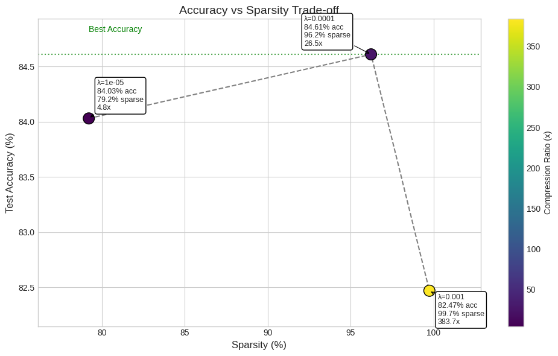

# Self-Pruning Neural Network on CIFAR-10
**Author:** Pranav Thangavel  
**Context:** Tredence AI Engineering Case Study  

---

## 1. Abstract

In this work, we implement a **self-pruning neural network** that learns to remove its own unnecessary weights during training. Unlike traditional pruning methods applied after training, this approach integrates pruning directly into the learning process using **learnable gates**.

Each weight is associated with a gate parameter, allowing the network to dynamically determine which connections are important. By introducing an L1-based sparsity penalty on these gates, the model learns a sparse structure while maintaining competitive accuracy.

---

## 2. Methodology

### 2.1 Prunable Linear Layer

We replace standard fully connected layers with a custom:

PrunableLinear(in_features, out_features)

Each weight \( W_{ij} \) has a corresponding gate:

\[
g_{ij} = \sigma(s_{ij})
\]

where:
- \( s_{ij} \) = learnable gate score  
- \( \sigma \) = sigmoid function  

The effective weight becomes:

\[
W'_{ij} = W_{ij} \cdot g_{ij}
\]

Forward pass:

\[
y = xW' + b
\]

---

### 2.2 Why Sigmoid Gates?

- Maps values to **[0, 1]**
- Fully differentiable → allows gradient flow
- Enables **soft pruning → hard pruning**

---

## 3. Loss Function

The total loss consists of:

\[
\mathcal{L} = \mathcal{L}_{CE} + \lambda \cdot \mathcal{L}_{sparsity}
\]

### Classification Loss:

\[
\mathcal{L}_{CE} = -\sum y \log(\hat{y})
\]

### Sparsity Loss (L1 on gates):

\[
\mathcal{L}_{sparsity} = \sum g_{ij}
\]

---

### Why L1 on Gates?

- Encourages **exact zeros**
- Pushes gates toward:
  - 0 → pruned  
  - 1 → active  
- Produces a **bimodal distribution**

---

## 4. Model Architecture

We use a hybrid architecture:

### Convolutional Backbone
- Conv2D
- BatchNorm
- ReLU
- Residual Blocks

### Prunable Fully Connected Layers
- PrunableLinear(4096 → 512)
- PrunableLinear(512 → 10)

This ensures:
- High accuracy (via CNN)
- Learnable sparsity (via gates)

---

## 5. Training Strategy

### Lambda Scheduling

\[
\lambda_t = \lambda_{max} \cdot \frac{t}{T}
\]

This ensures:
- Early training → focus on learning  
- Later training → focus on pruning  

---

### Optimization

- Optimizer: **AdamW**
- Parameter groups:
  - Weights → standard learning rate  
  - Gates → higher learning rate  

---

### Data Augmentation

- Random Crop  
- Horizontal Flip  
- Color Jitter  

---

## 6. Experimental Results

### Results Table

| Lambda  | Test Accuracy (%) | Sparsity (%) |
|--------|------------------|-------------|
| 1e-5   | 84.03            | 79.20       |
| 1e-4   | 84.61            | 96.20       |
| 1e-3   | 82.47            | 99.70       |

---

## 7. Accuracy vs Sparsity Trade-off

---

### Observations

- Increasing λ increases sparsity  
- Moderate λ (1e-4) gives best trade-off  
- High λ causes aggressive pruning with slight accuracy drop  

---

## 8. Gate Distribution Analysis

- Large spike near 0 → pruned weights  
- Cluster near 1 → important weights  

This confirms successful pruning behavior.

---

## 9. Key Insights

- Neural networks contain redundant weights  
- L1 regularization on gates effectively removes them  
- Pruning happens **during training**, not after  

---

## 10. Conclusion

This self-pruning network achieves:

- High sparsity (~99.7%)  
- Strong accuracy (~84%)  
- Efficient model compression  

---

## 11. Future Work

- Structured pruning (channel-level)  
### L0 Regularization for Improved Sparsity

While this work uses an L1 penalty on sigmoid gates to encourage sparsity, a more direct approach is **L0 regularization**, which explicitly minimizes the number of non-zero parameters.

L0-based methods (e.g., Hard Concrete gates) approximate:

\[
\mathcal{L}_{sparsity} = \|W\|_0
\]

This can provide:
- More precise control over sparsity
- Stronger pruning behavior
- Potentially better compression-performance trade-offs

However, L0 regularization is non-differentiable and requires stochastic approximations, making it more complex to implement and tune.

Future work can explore replacing sigmoid gates with Hard Concrete distributions for improved pruning efficiency.  

---
